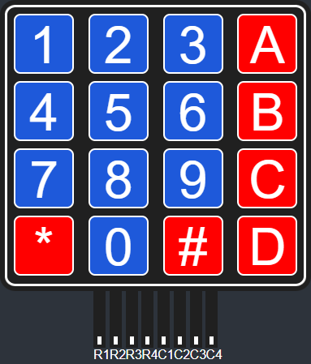

# Keypad Library

ESP-IDF keypad library supports 4x4 and 4x3 layouts (see below).



## Install

Inside your project library dir, run:
```
git submodule add https://github.com/william-hazem/keypad4x4
```

or 

```
git clone https://github.com/william-hazem/keypad4x4
```
